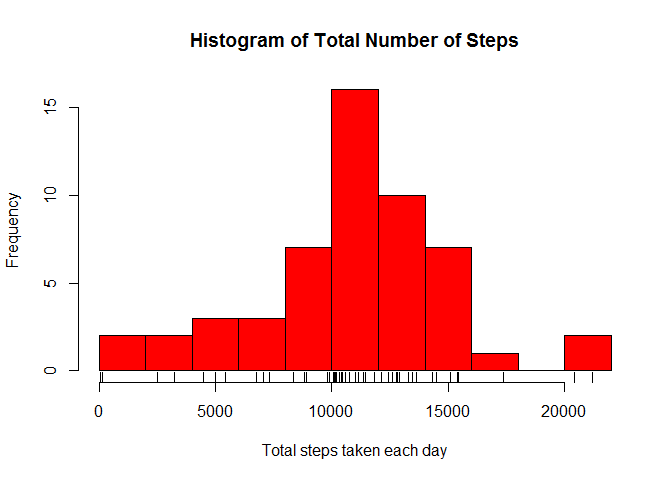
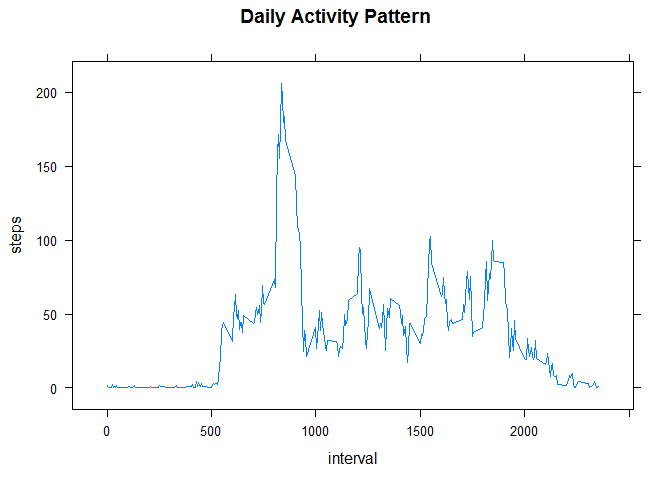

# Reproducible Research: Peer Assessment 1

This assignment will be described in multiple parts. You will need to write a report that answers the questions detailed below. Ultimately, you will need to complete the entire assignment in a **single R markdown** document that can be processed by **knitr** and be transformed into an HTML file.

Throughout your report make sure you always include the code that you used to generate the output you present. When writing code chunks in the R markdown document, always use **echo = TRUE** so that someone else will be able to read the code. This assignment will be evaluated via peer assessment so it is essential that your peer evaluators be able to review the code for your analysis.

For the plotting aspects of this assignment, feel free to use any plotting system in R (i.e., base, lattice, ggplot2)

### Loading the necessary packages


```r
library(lattice)
```

## Loading and preprocessing the data
Show any code that is needed to

1. Load the data (i.e. read.csv())
2. Process/transform the data (if necessary) into a format suitable for your analysis

### Code 
Check if the data set has been downloaded, otherwise download the data into the current working directory.
After download, unzip the raw data and extract the **.csv** data set.

**Note:** check if you have set the correct working directory before running the code.


```r
## create a directory named "data" where to place the downloaded data
data <- "data"
if(!file.exists(data)){
        dir.create(data)
        }

## url where data are available for download        
url_data <- "https://d396qusza40orc.cloudfront.net/repdata%2Fdata%2Factivity.zip"

## download the raw data   
archive <- paste(getwd(), "/activity.zip", sep = "")
if(!file.exists(archive)){
                download.file(url_data, archive, mode="wb")
        }

## unzip the raw data
activity_file <- paste(getwd(), "/data/activity.csv", sep = "")
        if(!file.exists(activity_file)){
                unzip(archive, list = FALSE, overwrite = FALSE, exdir = data)
        }
```

Load the raw data into ```R```

```r
activity <- read.csv(activity_file)
```

Check dimention of the loaded data:

```r
dim(activity)
```

```
## [1] 17568     3
```

Check ``activity`` first raws and structure

```r
head(activity)
```

```
##   steps       date interval
## 1    NA 2012-10-01        0
## 2    NA 2012-10-01        5
## 3    NA 2012-10-01       10
## 4    NA 2012-10-01       15
## 5    NA 2012-10-01       20
## 6    NA 2012-10-01       25
```

```r
str(activity)
```

```
## 'data.frame':	17568 obs. of  3 variables:
##  $ steps   : int  NA NA NA NA NA NA NA NA NA NA ...
##  $ date    : Factor w/ 61 levels "2012-10-01","2012-10-02",..: 1 1 1 1 1 1 1 1 1 1 ...
##  $ interval: int  0 5 10 15 20 25 30 35 40 45 ...
```

Create a new column ``date1``, which contain the date in a **Date** format. It will be used to compare activity between weekdays and weekend

```r
activity$date1 <- as.Date(as.character(activity$date))
```

Data looks ready to start the exploratory analysis.

## What is mean total number of steps taken per day?
For this part of the assignment, you can ignore the missing values in the dataset.

1. Calculate the total number of steps taken per day
2. If you do not understand the difference between a histogram and a barplot, research the difference between them. Make a histogram of the total number of steps taken each day
3. Calculate and report the mean and median of the total number of steps taken per day

### Code 
For this part of the assignment, missing values in the dataset will be ignored.

Create summary data to be plotted: total number of steps taken each day

```r
totalStepsDay <- aggregate(steps ~ date, activity, sum)
```

```totalStepsDay``` is a new data set with 2 dimentions. It contains the total number of steps taken for each day of the experiment (October and November, 2012)


```r
dim(totalStepsDay)
```

```
## [1] 53  2
```

```r
head(totalStepsDay)
```

```
##         date steps
## 1 2012-10-02   126
## 2 2012-10-03 11352
## 3 2012-10-04 12116
## 4 2012-10-05 13294
## 5 2012-10-06 15420
## 6 2012-10-07 11015
```

Plot the histogram of total number of steps taken each day. 

Prepare the output file Histogram1.png and define the area

```r
png(file="Histogram1.png", height=480, width=480)
```
        

```r
hist(totalStepsDay$steps,
     breaks = 10,
     col = "red", 
     xlab = "Total steps taken each day",
     main = "Histogram of Total Number of Steps"
     )   

## add rug representation of the data to the plot to show the density of the observation:
rug(totalStepsDay$steps)
```

 

```r
dev.off()
```

```
## png 
##   3
```

Calculate and report the **mean** and **median** total number of steps taken per day


```r
steps_statistics <- summary(totalStepsDay$steps)
steps_statistics
```

```
##    Min. 1st Qu.  Median    Mean 3rd Qu.    Max. 
##      41    8841   10760   10770   13290   21190
```

In average, the number of steps taken each day is:

```r
steps_statistics["Mean"]
```

```
##  Mean 
## 10770
```

For the ``50%`` of the days, the total number of steps taken during the day is above:

```r
steps_statistics["Median"]
```

```
## Median 
##  10760
```

## What is the average daily activity pattern?
1. Make a time series plot (i.e. type = "l") of the 5-minute interval (x-axis) and the average number of steps taken, averaged across all days (y-axis)
2. Which 5-minute interval, on average across all the days in the dataset, contains the maximum number of steps?

### Code

Create summary data to be plotted: average number of steps taken in the 5-minute interval across all days

```r
avgStepsInterval <- aggregate(steps ~ interval, activity, mean)

dim(avgStepsInterval)
```

```
## [1] 288   2
```

```r
head(avgStepsInterval)
```

```
##   interval     steps
## 1        0 1.7169811
## 2        5 0.3396226
## 3       10 0.1320755
## 4       15 0.1509434
## 5       20 0.0754717
## 6       25 2.0943396
```

Create the time series plot

```r
xyplot(steps ~ interval, data = avgStepsInterval, type = "l", main = "Daily Activity Pattern")
```

 

Find the maximum of number of steps taken in a 5-minute interval, averaged across all days


```r
steps_statistics_2 <- summary(avgStepsInterval$steps)
steps_statistics_2
```

```
##    Min. 1st Qu.  Median    Mean 3rd Qu.    Max. 
##   0.000   2.486  34.110  37.380  52.830 206.200
```

Find the 5-minute interval where the maximum number of steps is taken

```r
## find the row index of the maximum number of steps averaged across all days
index_max <- which.max(avgStepsInterval$steps)
interval_max_steps <- avgStepsInterval[index_max, 1]
interval_max_steps
```

```
## [1] 835
```

## Imputing missing values

Note that there are a number of days/intervals where there are missing values (coded as NA). The presence of missing days may introduce bias into some calculations or summaries of the data.

1. Calculate and report the total number of missing values in the dataset (i.e. the total number of rows with NAs)

2. Devise a strategy for filling in all of the missing values in the dataset. The strategy does not need to be sophisticated. For example, you could use the mean/median for that day, or the mean for that 5-minute interval, etc.

3. Create a new dataset that is equal to the original dataset but with the missing data filled in.

4. Make a histogram of the total number of steps taken each day and Calculate and report the mean and median total number of steps taken per day. Do these values differ from the estimates from the first part of the assignment? What is the impact of imputing missing data on the estimates of the total daily number of steps?

### Code

The number of missing values in the dataset ````activity.csv``` is


```r
sum(is.na(activity))
```

```
## [1] 2304
```

This means that in the ``activity`` dataset there **2304** rows with **NAs**.

We will fill in all of the missing values in the dataset with the mean for the 5-minutes interval.

Create the new dataset with the missing data filled in

```r
##create a second dataset where NA values will be filled in
activityfill <- activity

##fill in all of the missing value with the mean for that 5-minute interval
for (i in 1:17568){
        if(is.na(activityfill$steps[i])){
                interval_i <- activity$interval[i]
                activityfill$steps[i] <- as.numeric(subset(avgStepsInterval, interval %in% interval_i, select = steps))
        }
        
}
```

Check that the new data frame ```activityfill``` does not have any missing value

```r
sum(is.na(activityfill$steps))
```

```
## [1] 0
```

Using the new dataset, without the missing values, create summary data to be plotted: total number of steps taken each day

```r
totalStepsDayFill <- aggregate(steps ~ date, activityfill, sum)
```

Plot the histogram of total number of steps taken each day. 
Graphics devide used is the screen device.

```r
hist(totalStepsDayFill$steps,
     breaks = 10,
     col = "red", 
     xlab = "Total steps taken each day",
     main = "Histogram of Total Number of Steps (withouth NAs)"
     )   

## add rug representation of the data to the plot:
rug(totalStepsDayFill$steps)
```

 

Calculate and report the **mean** and **median** total number of steps taken per day


```r
steps_statistics_fill <- summary(totalStepsDayFill$steps)
steps_statistics_fill
```

```
##    Min. 1st Qu.  Median    Mean 3rd Qu.    Max. 
##      41    9819   10770   10770   12810   21190
```

Mean has not changed compared to the first estimates from the first part of the assignment. 
Median is now equal to the mean. 

Filling in all of the missing values with the average number of steps taken in the corresponding 5-minute interval moved the median of the total number of steps taken each day to be equal to the mean of the same.

## Are there differences in activity patterns between weekdays and weekends?
For this part the ``weekdays()`` function may be of some help here. Use the dataset with the filled-in missing values for this part.

1. Create a new factor variable in the dataset with two levels - "weekday" and "weekend" indicating whether a given date is a weekday or weekend day.
2. Make a panel plot containing a time series plot (i.e. type = "l") of the 5-minute interval (x-axis) and the average number of steps taken, averaged across all weekday days or weekend days (y-axis). See the README file in the GitHub repository to see an example of what this plot should look like using simulated data.

### Code
In order to create a new factor variable to distinguish weekdays and weekend, we create a new variable in the dataset with the day of the week

```r
activityfill$Wday <- weekdays(activityfill$date1)
str(activityfill)
```

```
## 'data.frame':	17568 obs. of  5 variables:
##  $ steps   : num  1.717 0.3396 0.1321 0.1509 0.0755 ...
##  $ date    : Factor w/ 61 levels "2012-10-01","2012-10-02",..: 1 1 1 1 1 1 1 1 1 1 ...
##  $ interval: int  0 5 10 15 20 25 30 35 40 45 ...
##  $ date1   : Date, format: "2012-10-01" "2012-10-01" ...
##  $ Wday    : chr  "Monday" "Monday" "Monday" "Monday" ...
```

Create the factor variable with two levels - "weekday" and "weekend" indicating whether a given date is a weekday or weekend day

```r
for (i in 1:17568){
        if(activityfill$Wday[i] %in% c("Saturday", "Sunday"))
                activityfill$FlagDay[i] <- "weekend"
        else activityfill$FlagDay[i] <- "weekday"
}

##convert the new column FlagDay into a factor variable
activityfill$FlagDay <- as.factor(activityfill$FlagDay)
```

Calculate the average number of steps taken, averaged across all weekday days or weekend days


```r
avgStepsIntervalFill <- aggregate(steps ~ FlagDay + interval, activityfill, mean)
```

Plot the time series

```r
xyplot(steps ~ interval | FlagDay, data = avgStepsIntervalFill, layout = c(1, 2), type = "l")
```

 
